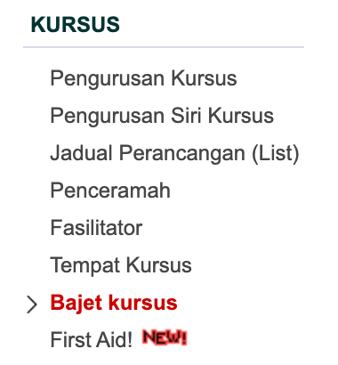
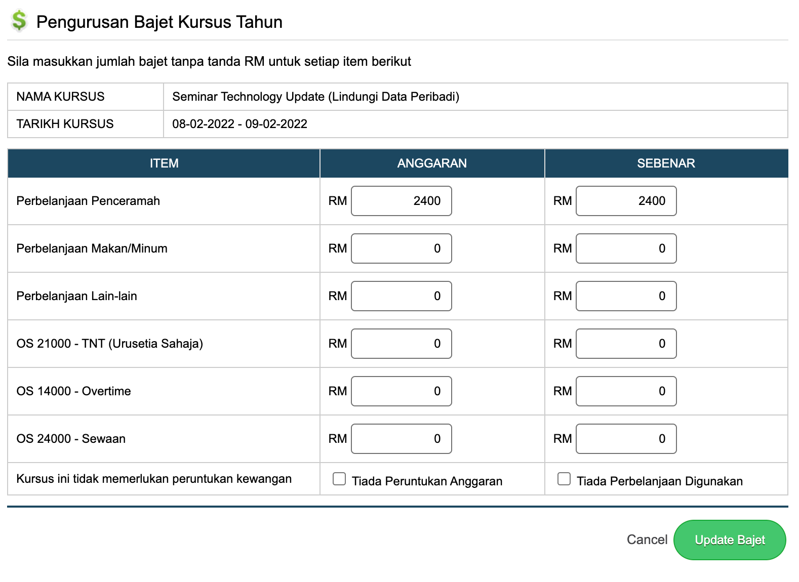

# Pemantauan Penggunaan Bajet Latihan

Bajet latihan perlu dirancang apabila sesuatu kursus dicadangkan. Bajet ini perlu bagi mengetahui jumlah perbelanjaan yang akan digunakan. Terdapat menu bajet kursus yang perlu dilengkapkan untuk setiap item sebelum pelaksanaan kursus.

Klik pada menu bajet kursus.

Paparan Pengurusan bajet kursus bagi tahun semasa dipaparkan. Pada menu ini, setiap kursus yang dirancang pelaksanaannya perlu melengkapkan maklumat bajet pada ruangan anggaran.

Anggaran iaitu bajet yang dirancang sebelum pelaksanaan kursus meliputi bajet Penceramah, Makan, TNT, Overtime, Sewaan dan lain-lain bajet diperlukan. 

Apabila selesai kursus dijalankan, ruangan sebenar bajet hendaklah dilengkapkan bagi mudah untuk membuat perbandingan perbelanjaan yang dirancang dengan perbelanjaan sebenar.

Klik pada nama kursus untuk melengkapkan bajet kursus.  Lengkapkan maklumat di ruangan anggaran sebelum kursus dijalankan dan di ruangan sebenar selepas pelaksanaan kursus.

Setelah selesai, klik butang update bajet.

