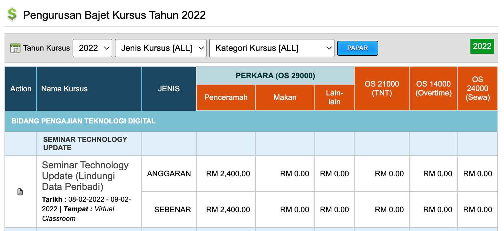

# Pemantauan Penggunaan Bajet Latihan

## Pengenalan

Bajet latihan perlu dirancang apabila sesuatu kursus telah dimasukkan dalam POL (Plan Operasi Latihan). Bajet ini perlu bagi mengetahui jumlah perbelanjaan semasa dan prestasi perbelanjaan yang telah dicapai bagi memastikan peruntukan yang diterima dibelanjakan sebaiknya. 

Terdapat menu bajet kursus yang perlu dilengkapkan untuk setiap item sebelum pelaksanaan kursus.

## Kaedah kemaskini bajet

Klik pada menu bajet kursus.

Paparan Pengurusan bajet kursus bagi tahun semasa dipaparkan. Pada menu ini, setiap kursus yang dirancang pelaksanaannya perlu dilengkapkan maklumat bajet pada ruangan anggaran.

Anggaran iaitu bajet yang dirancang sebelum pelaksanaan kursus meliputi bajet Penceramah, Makan, TNT, Overtime, Sewaan dan lain-lain bajet diperlukan. 

Apabila selesai kursus dijalankan, ruangan sebenar bajet hendaklah dilengkapkan bagi mudah untuk membuat perbandingan perbelanjaan yang dirancang dengan perbelanjaan sebenar.

Klik pada nama kursus untuk melengkapkan bajet.  Lengkapkan butiran maklumat di ruangan anggaran sebelum kursus dijalankan dan di ruangan sebenar selepas pelaksanaan kursus.

Setelah selesai, klik butang update bajet untuk kemaskini.

## Pemantauan Prestasi Penggunaan

Pemantuan prestasi penggunaan boleh dilihat jelas melalui menu berikut : 

    Laporan Umum > Analisis Kewangan

Sistem akan memaparkan analisis bajet seperti berikut : 

