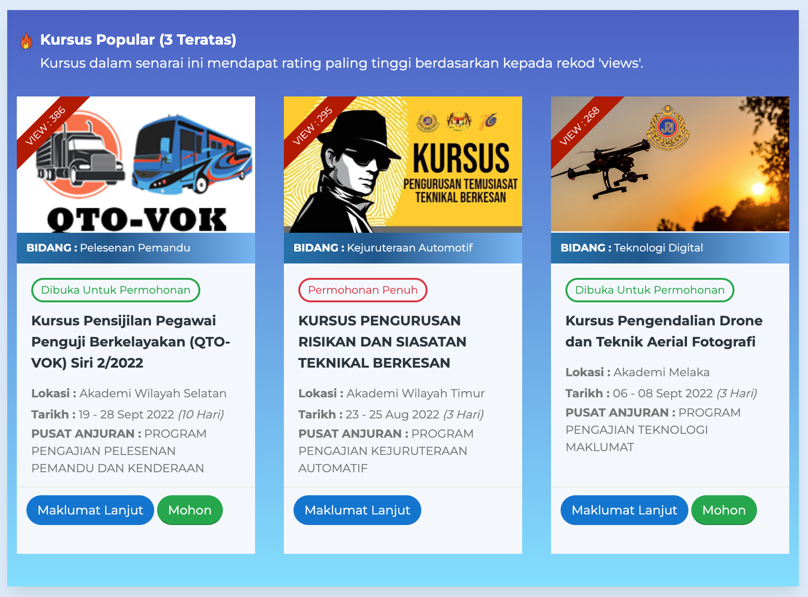
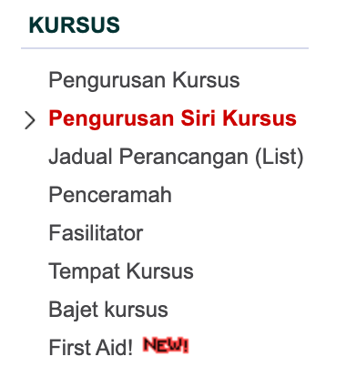
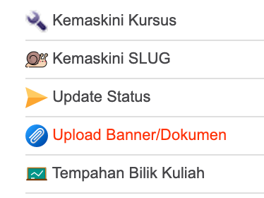
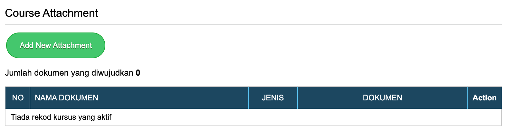
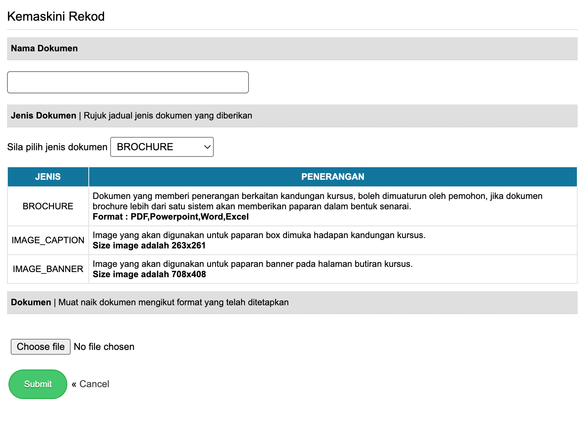
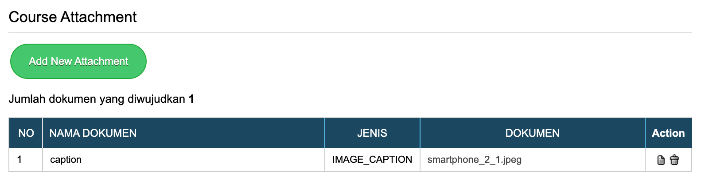
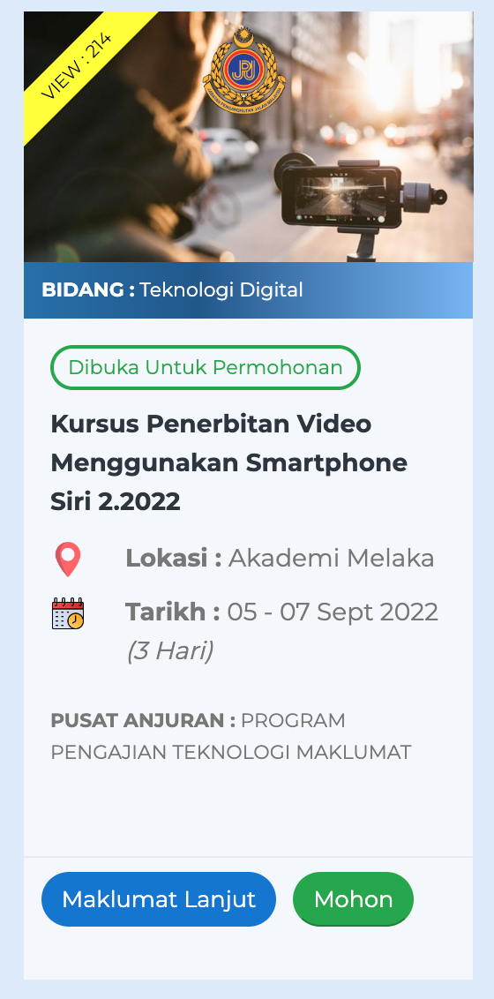

# Upload Banner Kursus

Banner kursus kebiasaanya menerangkan mengenai kursus tersebut. 

Pilih Pengurusan Siri Kursus

Pilih kursus yang dikehendaki untuk dikemaskini banner kursus

Pilih menu upload banner/dokumen

Klik pada butang Add New Attachment

Kemaskini maklumat banner tersebut. Masukkan nama dokumen, pilih jenis dokumen dan masukkan file banner tersebut. Penerangan berkenaan jenis dokumen diterangkan dalam ruangan tersebut.

Klik butang submit setelah selesai kemaskini maklumat.

Berikut adalah maklumat banner yang telah dikemaskini.

Hasilnya, banner dipaparkan pada kalendar kursus

