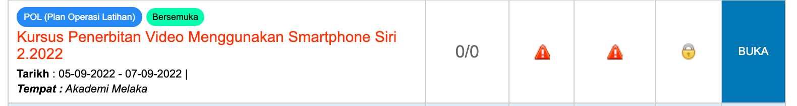

# Banner Kursus

Setiap kursus yang dipaparkan di katalog kursus etims mempunyai banner yang bertujuan memberikan gambaran dan tarikan kepada penerangan kursus yang dipaparkan. Sekiranya banner ini tidak dikemaskini sistem akan menggunakan random banner untuk paparan katalong. Penggunaan random banner ini tidak memberikan visual yang menarik kepada kursus yang anda tawarkan kepada calon.

Contoh paparan banner di katalog kursus adalah seperti berikut : 

**Ikuti langkah mudah dibawah untuk membuat pengemaskini pada katalog kursus anda.** 

Klik pada menu : 

Pilih kursus yang dikehendaki untuk dikemaskini banner kursus

Pilih menu upload banner/dokumen

Klik pada butang `Add New Attachment`

Borang kemaskini banner akan dipaparkan seperti berikut : 

Kemaskini maklumat banner tersebut. 

1. Masukkan nama dokumen (apa sahaja nama boleh dimasukkan)
2. pilih jenis dokumen `IMAGE_CAPTION`
3. `Choose file` pilih file image yang hendak dimuatnaik.

Klik butang `submit` setelah selesai kemaskini maklumat. Dokumen image yang telah dimuatnaik sekiranya berjaya akan dipaparkan seperti berikut : 

Hasilnya, banner akan dipaparkan pada katalog kursus seperti berikut : 

