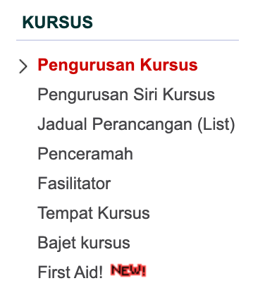
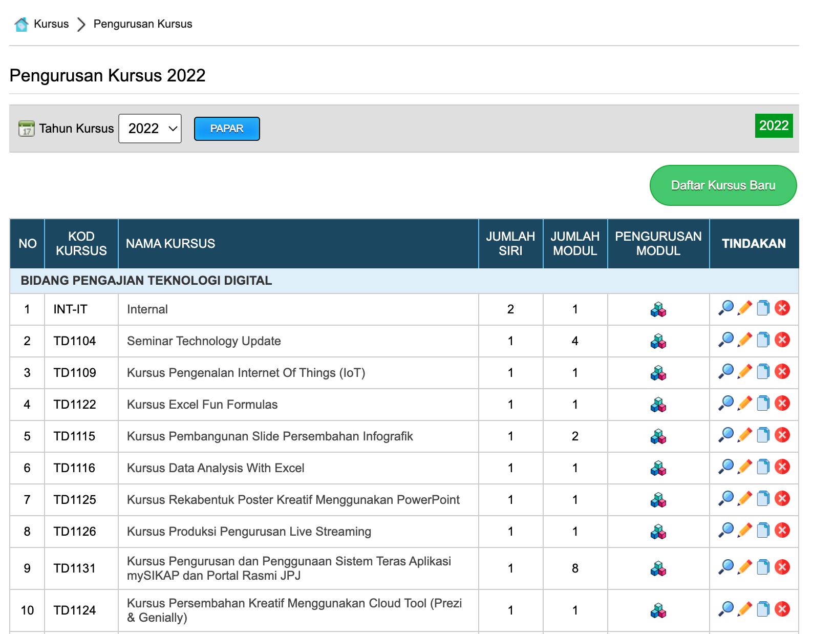
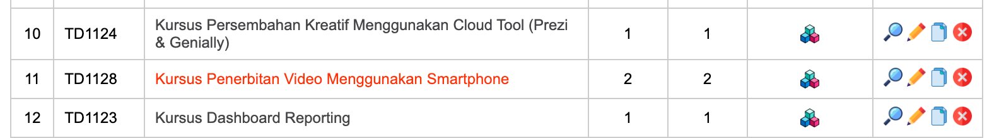
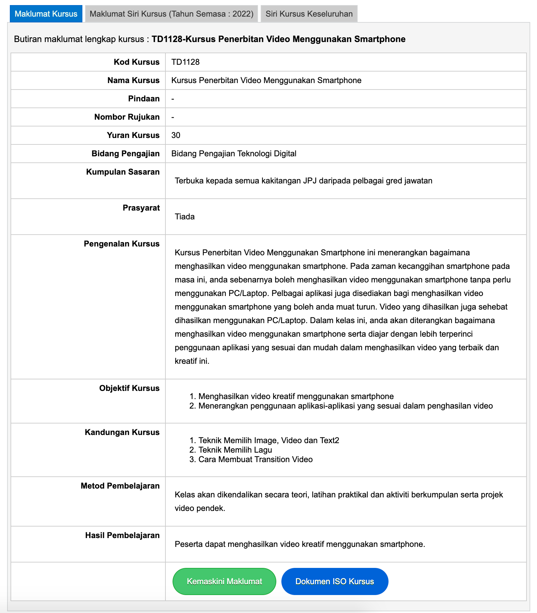
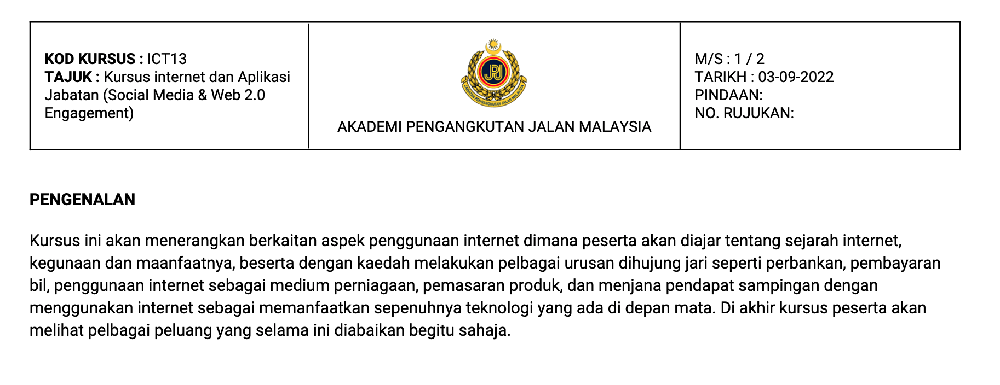

# Penjanaan Dokumen ISO

Dokumen ISO kursus boleh diperolehi dalam format ISO piawai yang telah ditetapkan. Anda hanya perlu melengkapkan semua butiran kursus yang diperlukan sebelum menjada dokumen tersebut. Format dokumen dapat dijana melalui menu berikut : 

    https://academy.jpj.gov.my/etraining/cp/kursus.php

Klik pada menu pengurusan kursus

Senarai paparan kursus di bawah program pengajian dipaparkan mengikut tahun semasa

Pilih kursus bagi tujuan cetakan ISO dari senarai paparan kursus

Maklumat berkenaan kursus dipaparkan. Pastikan maklumat di setiap ruang dipenuhkan terlebih dahulu.

Di bahagian bawah maklumat kursus terdapat butang Dokumen ISO bewarna biru. klik butang tersebut untuk mencetak dokumen ISO atau menyimpan dalam bentuk PDF.

Dokumen ISO akan dipaparkan seperti berikut untuk cetakan atau simpanan : 

