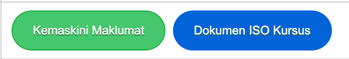

# Penjanaan Dokumen ISO

Dokumen ISO kursus dalam format ISO yang ditetapkan untuk maklumat kursus

Klik pada menu pengurusan kursus

Senarai paparan kursus di bawah program pengajian dipaparkan mengikut tahun semasa

Pilih kursus bagi tujuan cetakan ISO dari senarai paparan kursus

Maklumat berkenaan kursus dipaparkan. Pastikan maklumat di setiap ruang dipenuhkan terlebih dahulu.

Di bahagian bawah maklumat kursus terdapat butang Dokumen ISO bewarna biru. klik butang tersebut.

Maklumat berkenaan kursus dipaparkan mengikut format ISO. Cetak maklumat tersebut sekiranya diperlukan.

