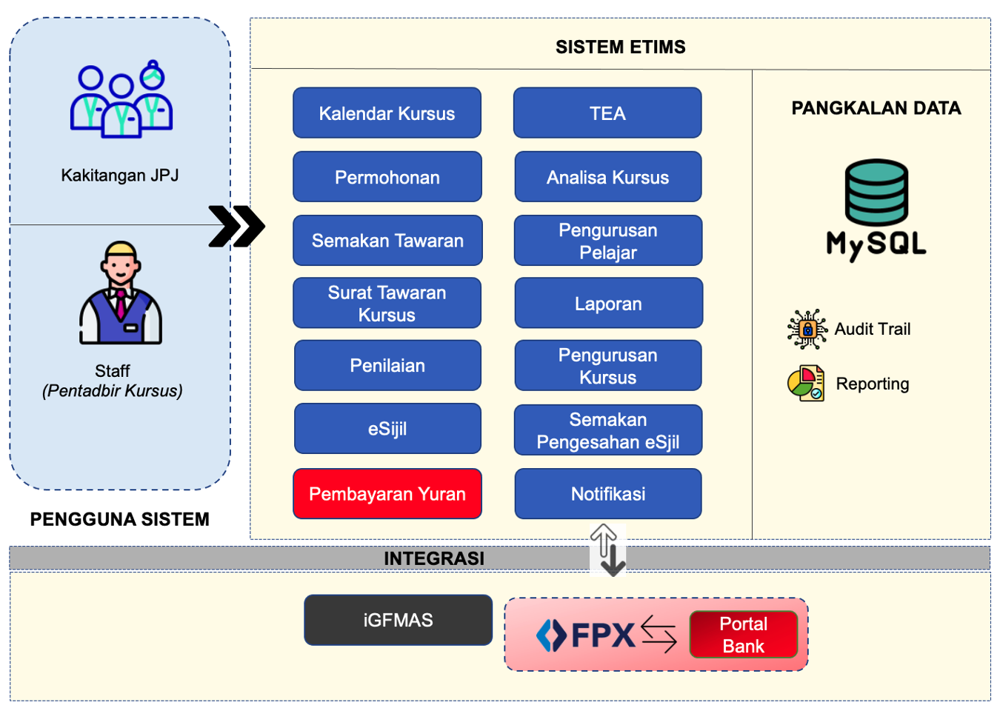

# Welcome to eTraining Manual

---- 

## Pengenalan

eTraining adalah merupakan bahagian pentadbiran sistem untuk pengurusan katalog kursus akademi. eTims menawarkan pelbagai fungsi yang meliputi semua aspek pengurusan latihan dari tawaran sehinggalah kepada penilaian dan penjanaan sijil kursus. Rekabentuk sistem eTims adalah seperti rajah berikut : 

Fungi pembayaran yuran kursus dalam proses pembangunan sistem dan akan dapat digunakan tidak lama lagi. :smile: :heart_eyes_cat: 

## Capaian Sistem

URL untuk pentadbiran sistem adalah : 

    https://academy.jpj.gov.my/etraining/cp

Katalog kursus yang dijana dari sistem boleh dicapai dari URL berikut :

    https://academy.jpj.gov.my/

Manual online ini menyediakan maklumat kepada anda untuk pengurusan sistem yang teratur dan efisien. Terdapat pelbagai dokumen rujukan yang disediakan untuk bacaan masa lapang anda bagi memastikan anda tetap terus berada dalam jalan kebenaran dalam menguruskan latihan Akademi. InsyaAllah.

وَمَنْ سَلَكَ طَرِيقًا يَلْتَمِسُ فِيهِ عِلْمًا سَهَّلَ اللَّهُ لَهُ بِهِ طَرِيقًا إِلَى الْجَنَّةِ

*Artinya: "Siapa yang menempuh jalan untuk mencari ilmu, maka Allah akan mudahkan baginya jalan menuju syurga." (HR Muslim, no. 2699).*

---

[Lihat Dokumen Manual](manual.md){ .md-button .md-button--primary}

