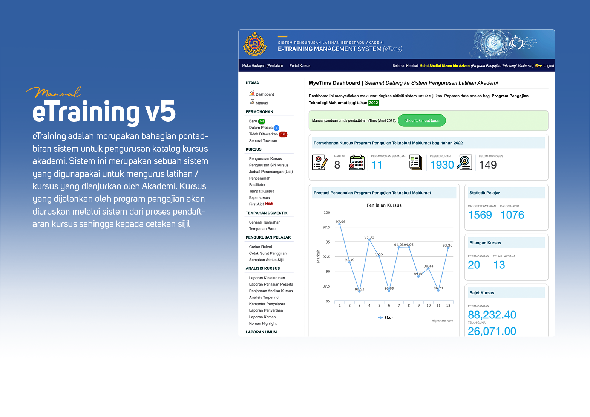

# Welcome to eTraining Manual

## Pengenalan

eTraining adalah merupakan bahagian pentadbiran sistem untuk pengurusan katalog kursus akademi. eTims menawarkan pelbagai fungsi yang meliputi semua aspek pengurusan latihan dari tawaran sehinggalah kepada penilaian dan penjanaan sijil kursus. Rekabentuk sistem eTims adalah seperti rajah berikut : 

Fungi pembayaran yuran kursus dalam proses pembangunan sistem dan akan dapat digunakan tidak lama lagi. :smile: :heart_eyes_cat: 

## Capaian Sistem

URL untuk pentadbiran sistem adalah : 

    https://academy.jpj.gov.my/etraining/cp

Katalog kursus yang dijana dari sistem boleh dicapai dari URL berikut :

    https://academy.jpj.gov.my/

Manual ini menyediakan panduan kepada anda untuk mendapatkan dokumen-dokumen manual sebagai bahan rujukan. 

---

[Lihat Dokumen Manual](manual.md){ .md-button .md-button--primary}

