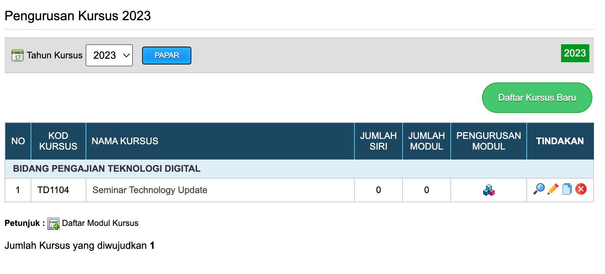

#Link Up Kod Kursus

Bagi program pengajian yang melaksanakan kursus yang sama dengan kursus pada tahun sebelumnya. Sudah tentu maklumat kursus tersebut telah tersedia didaftarkan dalam sistem. Oleh itu, kod kursus tersebut boleh disalin bersama maklumat kursus untuk ke tahun berikutnya. Fungsi ini memudahkan program pengajian dari mendaftar kod dan maklumat yang sama di dalam sistem.

Klik pada Menu Pengurusan Kursus

Pilih Kod kursus yang hendak di bawa ke tahun berikutnya dan klik butang Copy

Masukkan tahun berikutnya dan klik butang Salin

Kod kursus dan maklumat kursus tersebut telah disalin ke tahun berikutnya.

Maklumat kursus boleh dipinda semula mengikut kesesuaian tahun semasa.