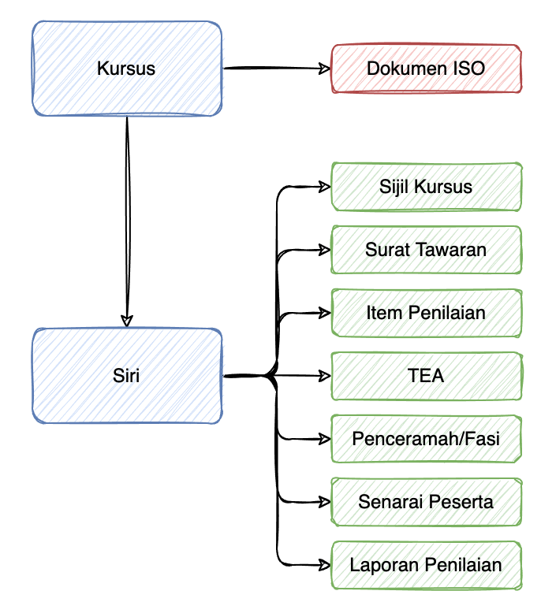

# Senarai Semakan Pelaksanaan Kursus

## Pengenalan 

Terdapat beberapa tindakan yang perlu diambil sebelum, semasa dan selepas pelaksanaan kursus dijalankan. Bagi memahami kedudukan modul yang terdapat didalam etims. Anda boleh melihat rajah dibawah dimana `kursus` adalah merujukan kepada nama kursus yang mempunyai kod kursus, manakala `siri` adalah bilangan siri kursus yang dijalankan dalam tahun semasa.

## Tatacara

Bagi anda yang menguruskan kursus, prosedur sebelum, semasa dan selepas perlu dibuat bagi menyempurnakan pelaksanaan kursus di dalam sistem.

### Sebelum Kursus

1. Daftar kursus di dalam pengurusan kursus dan lengkapkan maklumat yang diperlukan. <a href="https://academy.jpj.gov.my/etraining/cp/kursus.php" target="_blank">(Lihat)</a>
2. Daftar siri kursus yang hendak dijalankan dalam modul pengurusan siri kursus beserta butiran maklumat sekiranya terdaparat butiran yang spesifik untuk siri tersebut. <a href="https://academy.jpj.gov.my/etraining/cp/sesimanage.php" target="_blank">(Lihat)</a>
3. Pastikan status kursus adalah antara  **TUTUP/BUKA/PENUH/SELESAI/TANGGUH/BATAL** - status ini sahaja yang akan dipaparkan di ruangan katalog kursus akademi.
4. Kemaskini permohonan kursus pemohon kepada **DALAM PROSES** untuk membuat tawaran kursus. 
5. Lengkapkan maklumat surat panggilan kursus. Segala arahan kursus hendaklah dinyatakan di dalamnya. `Pengurusan Siri Kursus > Pilih Siri > Surat Panggilan Kursus` (Sistem akan menjana surat panggilan secara digital kepada calon)
6. Kemaskini status permohonan calon kepada  **TAWARAN BERJAYA** sekiranya berjaya dan **TIDAK DITAWARKAN** sekiranya tidak berjaya
7. Pastikan anda enable fungsi semakan tawaran bagi membolehkan pemohon membuat semakan tawaran kursus.
8. Anda juga boleh menggunakan fungsi check-in untuk daftar masuk pada hari pertama kursus. 

### Semasa Kursus

1. Kemaskini senarai kehadiran peserta kursus (Senarai kehadiran akan dijana secara automatik sekiranya anda aktifkan fungsi check-in).
2. Daftar maklumat penceramah untuk modul penilaian. 
3. Kenalpasti item yang perlu dibuat penilaian.
4. Buka penilaian kursus 
5. Laksana penilaian kursus dan pastikan semua pelajar membuat penilaian sebelum akhir kursus. (Anda boleh menyemak status penilaian pelajar `Pengurusan Siri Kursus > Pilih Siri > Status Penilaian Peserta`).

### Selepas Kursus

1. Lihat laporan penilaian kursus bagi tujuan penambahbaikan yang diperlukan. `Analisis Kursus > Laporan Keseluruhan`
2. Jana sijil peserta kursus. `Pengurusan Siri Kursus > Pilih Siri > Jana Sijil Kehadiran`
3. Kemaskini bajet kursus `Kursus > Bajet Kursus`
4. Lengkapkan laporan penyelaras kursus `Analisis Kursus > Komentar Penyelaras`
5. Tetapkan status kursus kepada **SELESAI**

Tahniah anda telah mengikut jalan kefahaman yang benar dan diredhai. Semoga tetap berada dalam kebenaran dan mendapat petunjuk yang jelas.

