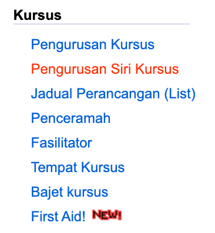
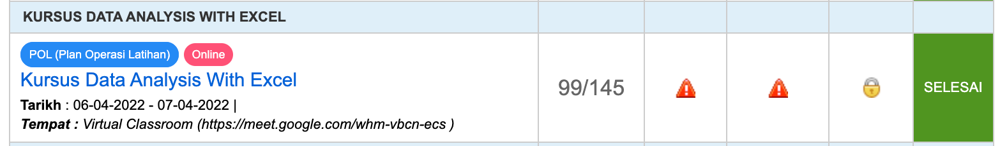
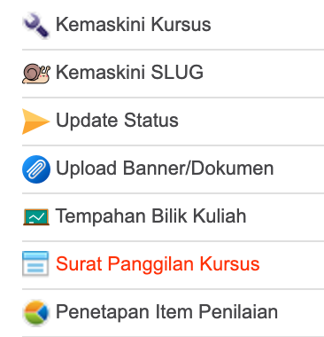
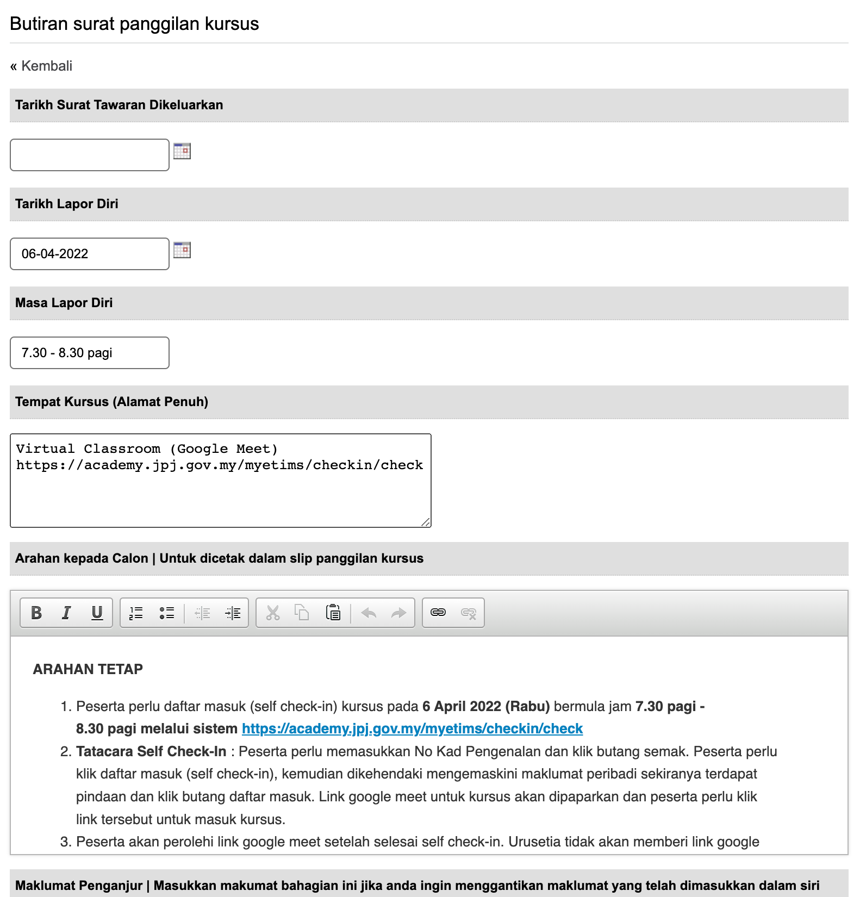
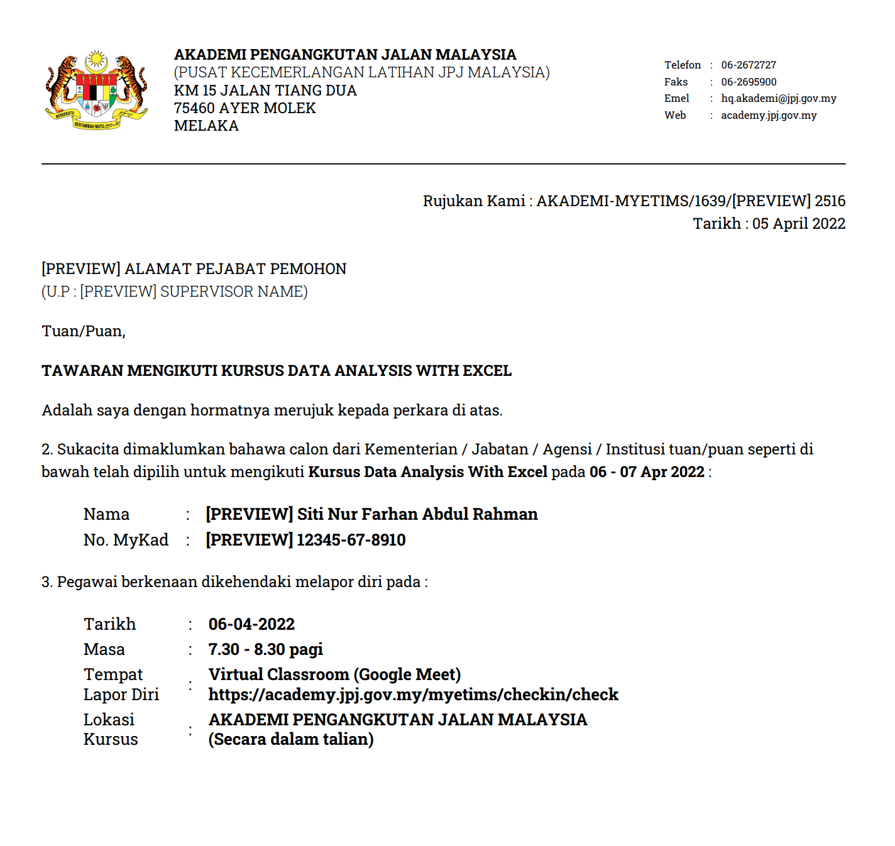

#Surat Panggilan Kursus

Surat panggilan kursus ini mengandungi maklumat kursus, arahan kepadap peserta kursus sebelum menghadiri kursus dan surat panggilan ini juga digunakan untuk peserta untuk diberi kepada penyelia sebagai makluman menghadiri kursus.

Klik pada menu pengurusan siri kursus

Pilih nama kursus yang hendak dilaksanakan 

Kemudian, klik menu surat panggilan kursus

Maklumat Butiran surat panggilan kursus dipaparkan. Klik butang kemaskini untuk mengemaskini maklumat kursus.

Maklumat di dalam butiran surat panggilan kursus boleh dikemaskini sesuai dengan kursus. Arahan kepada peserta juga perlu dimaklumkan di dalam surat panggilan kursus sebagai persediaan kepada peserta sebelum hadir berkursus.

Klik butang update setelah selesai kemaskini maklumat

Setelah selesai klik butang preview surat tawaran

Berikut adalah contoh surat panggilan kursus

