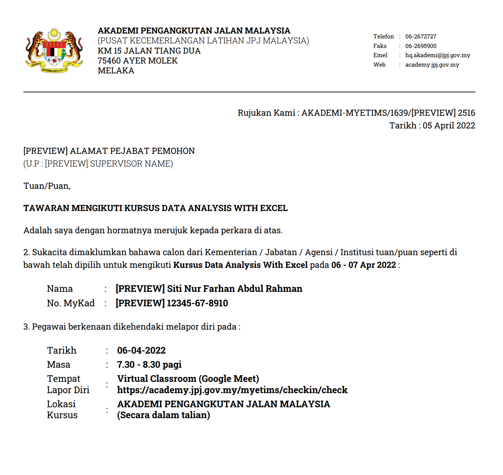

# Surat Panggilan Kursus

## Pengenalan

Sistem etims boleh menjaana surat panggilan kursus secara digital yang sama seperti surat manual. Penggunaan fungsi ini akan mengurangkan dan mempercepatkan proses kerja and dalam pengurusan kursus dan menjadikan anda lebih efektif dan super produktif.

Surat panggilan kursus ini mengandungi maklumat kursus, arahan kepadap peserta kursus sebelum menghadiri kursus dan surat panggilan ini juga digunakan untuk peserta untuk diberi kepada penyelia sebagai makluman menghadiri kursus dan digunakan juga dalam tuntutan perjalanan.

## Kemaskini Surat Panggilan Kursus

Klik pada menu pengurusan siri kursus

Pilih nama kursus yang hendak dilaksanakan 

Kemudian, klik menu surat panggilan kursus

Maklumat Butiran surat panggilan kursus akan dipaparkan seperti berikut : 

Maklumat di dalam butiran surat panggilan kursus boleh dikemaskini sesuai dengan kursus. Arahan kepada peserta juga perlu dimaklumkan di dalam surat panggilan kursus sebagai persediaan kepada peserta sebelum hadir berkursus.

Klik butang update setelah selesai kemaskini maklumat

Setelah selesai klik butang preview surat tawaran

Berikut adalah contoh surat panggilan kursus yang dijana oleh sistem : 

