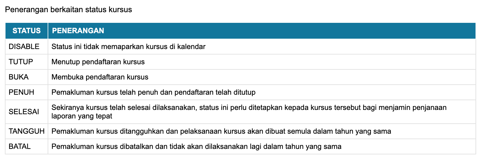
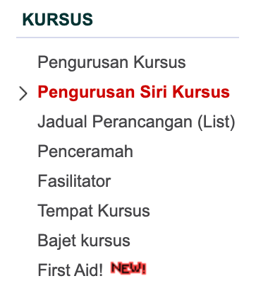
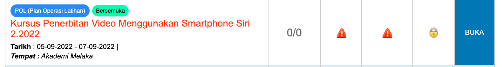
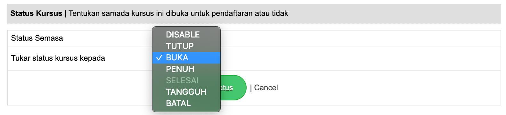
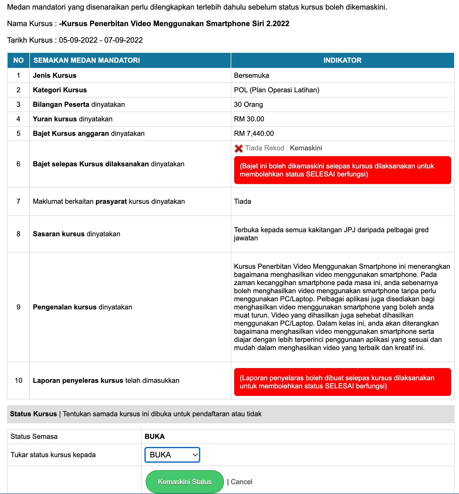

# Status kursus

Status kursus ini digunakan untuk memaklumkan kepada pemohon status kursus tersebut. Ia bagi memudahkan pemohon semasa hendak membuat permohonan. Penerangan status adalah seperti dalam jadual berikut : 

Untuk mengemaskini status kursus anda boleh klik pada menu berikut : 

Pilih kursus yang akan ditukar status

Klik pada update status untuk kemaskini status kursus

Di bahagian status kursus, klik dropdown untuk menukar status kursus seperti yang dikehendaki. 

Bagi status kursus **SELESAI** ia boleh ditetapkan apabila kursus tersebut selesai dilaksanakan. Bagi membolehkan status SELESAI dapat digunakan semua maklumat kursus dan maklumat mandatori perlu dilengkapkan terlebih dahulu seperti bajet selepas kursus dan laporan penyelaras kursus.

