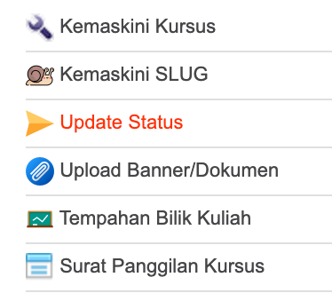

# Menu status kursus

Status kursus ini digunakan untuk memaklumkan kepada pemohon status kursus tersebut. Ia bagi memudahkan pemohon semasa hendak membuat permohonan. 

klik pada menu pengurusan siri kursus

Pilih kursus yang akan dilaksanakan

Klik pada update status untuk kemaskini status kursus

Di bahagian status kursus, klik dropdown untuk menukar status kursus seperti yang dikehendaki. 

Bagi status kursus SELESAI apabila selesai kursus tersebut dilaksanakan. Bagi membolehkan status tukar kepada SELESAI, maklumat kursus dan maklumat mandatori perlu dilengkapkan terlebih dahulu seperti bajet selepas kursus dan laporan penyelaras kursus.

Kemudian klik kemaskini kursus.

